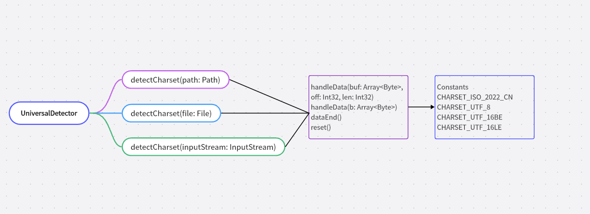

<div align="center">
<h1>chardet4cj</h1>
</div>

<p align="center">


</p>

## 介绍

是一个字符编码高效识别检测库

参考地址: https://github.com/albfernandez/juniversalchardet 版本2.4.0

### 特性

- 🚀 支持 ISO-2022-CN 编码格式

- 🚀 支持 UTF-8 编码格式

- 💪 支持 UTF-16BE / UTF-16LE 编码格式


##  架构




### 源码目录

```shell
.
├── doc
├── src
│   ├── charset_prober.cj
│   ├── coding_stateMachine.cj
│   ├── constants.cj
│   ├── encodingDetectorInputStream.cj
│   ├── encodingDetectorOutputStream.cj
│   ├── escCharset_prober.cj
│   ├── hzs_model.cj
│   ├── is02022cn_model.cj
│   ├── mbcsgroup_prober.cj
│   ├── pkgint.cj
│   ├── readerFactory.cj
│   ├── smmodel.cj
│   ├── unicode_bom.cj
│   ├── universalDetector.cj
│   ├── utf8_model.cj
│   └── utf8_prober.cj
├── test
│   ├── HLT
│   └── LLT
├── CHANGELOG.md
├── gitee_gate.cfg
├── LICENSE.txt
├── module.json
├── README.md
└── README.OpenSource
```

- `doc`  文档目录，用于存API接口文档
- `src`  是库源码目录
- `test` 存放 HLT 测试用例、LLT 自测用例

### 接口说明

主要类和函数接口说明详见 [API](./doc/feature_api.md)


## 使用说明

### 编译

#### linux环境编译

编译描述和具体shell命令

```shell
cjpm build
```

#### Window环境编译

编译描述和具体cmd命令

```cmd
cjpm build
```

### 功能示例
#### 基于 UTF-8 格式使用样例


```cangjie
from std import fs.*
from chardet4cj import chardet4cj.*

main() {
    var testFile1: Path = Path("./utf8.txt")
    var originalEncoding1: String = UniversalDetector.detectCharset(testFile1)
    println(originalEncoding1)

    var testFile: Path = Path("./utf8n.txt")
    var originalEncoding: String = UniversalDetector.detectCharset(testFile)
    println(originalEncoding)
    
    if (originalEncoding1 != "UTF-8") {
        return 1
    }
    if (originalEncoding != "UTF-8") {
        return 2
    }
    return 0
}
```

执行结果如下：

```shell
UTF-8
```

#### 基于 UTF-16BE 格式使用样例


```cangjie
from std import fs.*
from chardet4cj import chardet4cj.*

main() {
    var testFiles2: File = File("./utf16be.txt",Open(true, false))
    var originalEncodings2: String = UniversalDetector.detectCharset(testFiles2)
    println(originalEncodings2)
    if (originalEncodings2 != "UTF-16BE") {
        return 1
    }
    return 0
}
```

执行结果如下：

```shell
UTF-16BE
```

#### 基于 UTF-16LE 格式使用样例


```cangjie
from std import fs.*
from chardet4cj import chardet4cj.*

main() {
    var testFiles2: File = File("./utf16le.txt",Open(true, false))
    var originalEncodings2: String = UniversalDetector.detectCharset(testFiles2)
    println(originalEncodings2)
    if (originalEncodings2 != "UTF-16LE") {
        return 1
    }
    return 0
}
```

执行结果如下：

```shell
UTF-16LE
```

#### 基于 ISO-2022-CN 格式使用样例


```cangjie
from std import fs.*
from chardet4cj import chardet4cj.*

main() {
    var testFiles: File = File("./utf8.txt",Open(true, false))
    var originalEncodings: String = UniversalDetector.detectCharset(testFiles)
    println("ISO-2022-CN")
    if (originalEncodings != "UTF-8") {
        return 1
    }
    return 0
}
```

执行结果如下：

```shell
ISO-2022-CN
```

## 参与贡献

欢迎给我们提交PR，欢迎给我们提交Issue，欢迎参与任何形式的贡献。